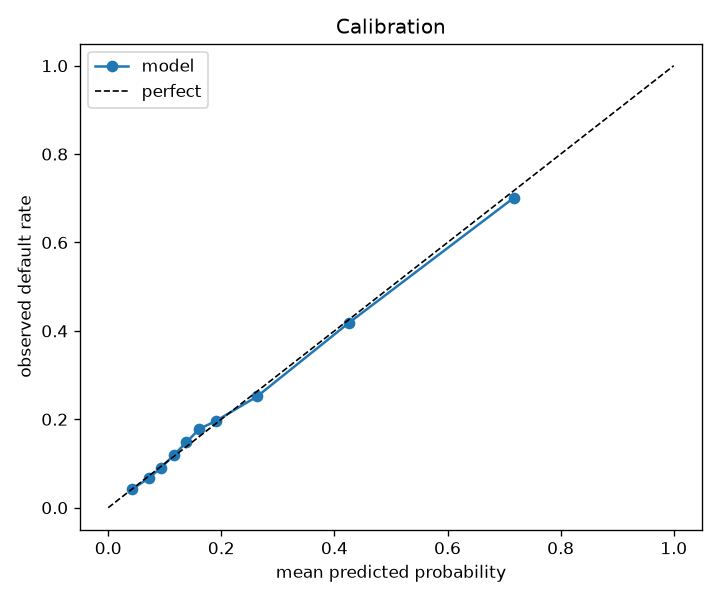
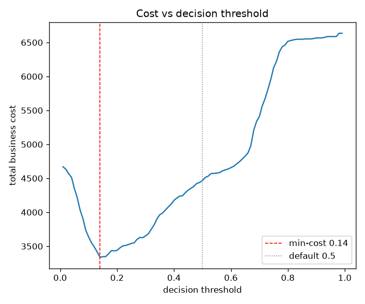

# Credit risk scoring platform


An end-to-end platform for credit-default scoring: it trains and versions a model,
serves it behind a validated API, and monitors the live traffic for feature drift,
with the supporting infrastructure to run the whole thing locally.

The modelling is deliberately honest rather than flashy (the dataset tops out
around 0.78 ROC-AUC), because the point of this project is the engineering around
the model: reproducible training, a versioned registry, input validation, a
cost-based decision, drift detection and observability.

## What is in here

| Layer | What it does |
| ----- | ------------ |
| Data | Loads the UCI Taiwan credit-default dataset and runs quality checks before training |
| Training | Cross-validates candidate models, calibrates the winner, picks a cost-based threshold, and registers a versioned model with metadata |
| Registry | File-based model registry: immutable versions, metadata next to the artifact, a `latest` pointer |
| Serving | FastAPI service with Pydantic input validation, single and batch scoring, model info and health |
| Monitoring | Population stability index (PSI) drift detection against a training reference, plus Prometheus metrics |
| Infrastructure | Multi-stage Docker image, a docker-compose stack with Prometheus and Grafana, CI that lints, tests and builds the image |

See [ARCHITECTURE.md](ARCHITECTURE.md) for how the pieces fit together and
[MODEL_CARD.md](MODEL_CARD.md) for the model details.

## Quickstart (local)

```bash
python -m venv .venv && source .venv/bin/activate
pip install -e ".[dev]"

credit-scoring train          # fetch data, train, evaluate, register a model
credit-scoring serve          # start the API on http://localhost:8000
pytest                        # run the test suite
```

With the API running, the interactive docs are at `http://localhost:8000/docs`.

```bash
curl -s http://localhost:8000/predict -H "content-type: application/json" -d '{
  "limit_bal": 20000, "sex": 2, "education": 2, "marriage": 1, "age": 24,
  "pay_0": 2, "pay_2": 2, "pay_3": -1, "pay_4": -1, "pay_5": -2, "pay_6": -2,
  "bill_amt1": 3913, "bill_amt2": 3102, "bill_amt3": 689,
  "bill_amt4": 0, "bill_amt5": 0, "bill_amt6": 0,
  "pay_amt1": 0, "pay_amt2": 689, "pay_amt3": 0,
  "pay_amt4": 0, "pay_amt5": 0, "pay_amt6": 0
}'
# {"default_probability":0.7263,"decision":"decline","threshold":0.14,"model_version":"..."}
```

## Quickstart (Docker)

```bash
docker compose up --build
```

This trains a model into a shared volume, serves it, and starts Prometheus and
Grafana:

- API: `http://localhost:8000` (docs at `/docs`, metrics at `/metrics`)
- Prometheus: `http://localhost:9090`
- Grafana: `http://localhost:3000` (anonymous access, a Credit Scoring dashboard is provisioned)

## The API

| Method | Path | Purpose |
| ------ | ---- | ------- |
| POST | `/predict` | Score a single application |
| POST | `/predict/batch` | Score up to 1000 applications and report drift on the batch |
| GET | `/model/info` | Version, algorithm, threshold and test metrics of the live model |
| GET | `/health` | Liveness and whether a model is loaded |
| GET | `/metrics` | Prometheus metrics |

Every request is validated against the `CreditApplication` schema first, so ranges,
categories and types are checked before the model ever sees the input. A bad value
returns a clear 422 rather than a silent wrong score.

The score is turned into an `approve` or `decline` decision with a threshold chosen
to minimise the expected business cost, on the assumption that approving a client
who then defaults is five times as costly as rejecting one who would have repaid.

## Monitoring

The training step saves a reference profile of every feature's distribution. At
serving time, each batch is compared against it with the population stability
index, and the result is exposed as Prometheus metrics (`credit_feature_psi`,
`credit_drift_detected`) alongside traffic, latency and score distribution. You can
reproduce a drift alert from the command line:

```bash
credit-scoring drift-check --n 800 --age-shift 40
# {"drift_detected": true, "drifted_features": ["age"], ...}
```

## Model performance

Gradient boosting wins the cross-validation against a logistic-regression baseline
and is evaluated on a held-out test set.

| metric | value |
| ------ | ----- |
| ROC-AUC | 0.779 |
| PR-AUC | 0.555 |
| Brier score | 0.135 |

The decision threshold matters more than the model. At the default 0.5 cut-off the
model would only catch 36% of defaulters; the cost-minimising threshold of 0.14
catches 82% of them and cuts the expected cost by about a quarter, at the price of
rejecting more good clients. The probabilities are calibrated, so they can be read
as real risks.




## Project layout

```
src/credit_scoring/
  config.py          typed settings (environment driven)
  domain.py          feature definitions
  schemas.py         Pydantic request and response models
  data/              loading and quality validation
  features/          preprocessing and candidate pipelines
  models/            evaluation, cost threshold, versioned registry
  monitoring/        reference profile, drift, Prometheus metrics
  serving/           FastAPI app and inference service
  training.py        training orchestration
  cli.py             command-line interface
docker/              multi-stage Dockerfile
config/              Prometheus and Grafana provisioning
tests/               unit and integration tests
```

## Tests

The suite runs offline: a small model is trained on synthetic data and registered
in a temporary registry, so the unit tests (threshold, drift, validation, schemas)
and the API integration tests run in about a second with no download.

```bash
pytest
ruff check src tests
```
